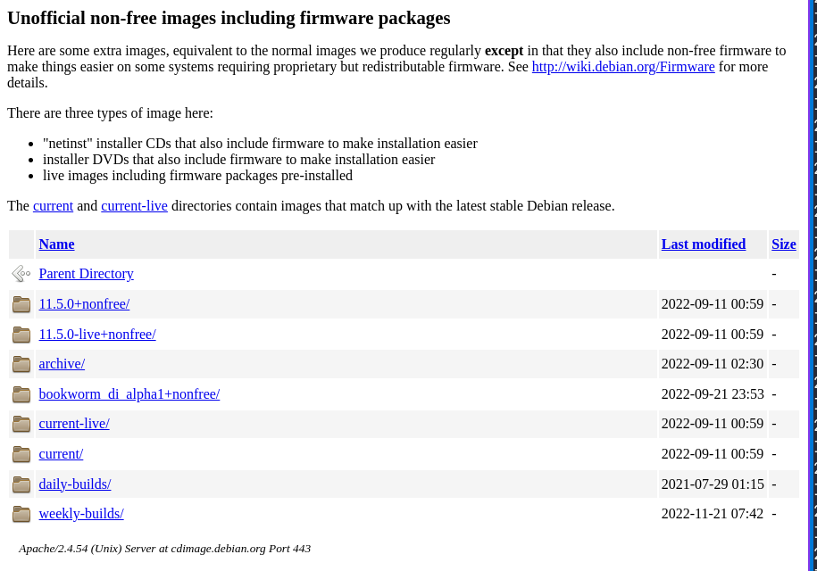
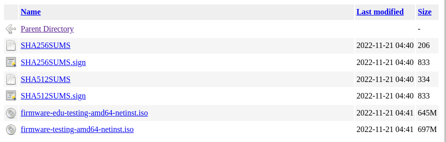
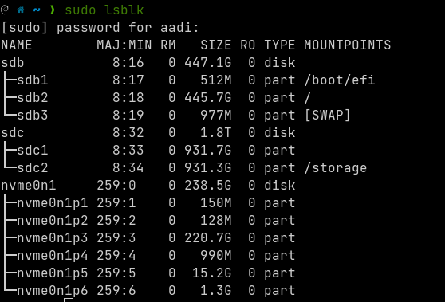

# Setting Up Debian for Machine Learning with NVIDIA GPUs

## Getting Debian
Go to [debian.org/download](https://www.debian.org/download) and click the link for [Unofficial non-free images](https://cdimage.debian.org/cdimage/unofficial/non-free/cd-including-firmware/). This is to enable the non-free drivers for your NVIDIA GPU, as the open-source libraries are, in short, problematic.

Go to `/weekly builds/amd64/iso-cd` which takes you to the following page: 

Click the `.iso` file with the word "testing" in the title (yes it's confusing). That will download the `ISO` file required to install Debian 11 to the directory specified. 

### Writing the ISO
Now comes the part with a bit of variation: if you're on windows, you're going to want to use a tool like [rufus](https://rufus.ie/en/) to flash the ISO to a flash-drive (at least 8 GB in size). If you're like me, and are in the process of distro-hopping, it's actually slightly easier.

1. Run `sudo lsblk` to find the devices plugged into your computer (assuming you already plugged in the drive you wish to flash to). The output should look like the following:

2. Find the drive you wish to flash to, and BE CAREFUL, this is NOT undoable. In my case, this is sdd (the flast drive). Now comes the "fun" part, run the following command to flash the ISO to the flash drive:
`sudo dd bs=4M if=/path/to/debian.iso of=/dev/sdd status=progress`  
`bs` specifies block size, `if` should be the absolute path to the Debian ISO, `of` should be the `NAME` parameter of the drive from the `lsblk` command, `status=progress` gives a nice verbose update and `oflag=sync` sets access for data and metadata.

### Booting the ISO
Okay, now you have a boot-able ISO of Debian. I'm not going through the entire backup process as everyone has different things they wish to preserve. Just know that this step will wipe your drive that you are installing Debian on. 

Restart the machine and spam `F12` for boot-options, selecting the flash-drive that you just flashed to boot from (typically named something with "Debian" in the title)